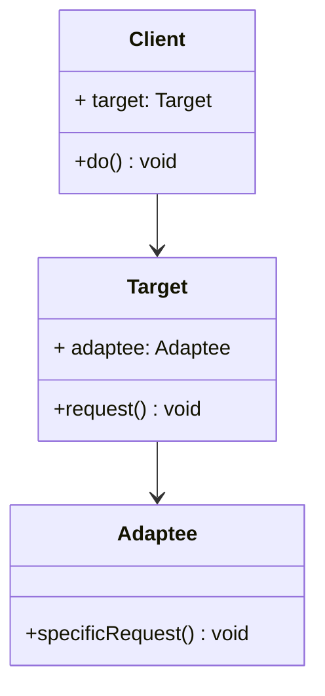

# 适配器模式 Adapter Pattern

## 介绍

- 旧接口格式和使用者不兼容
- 中间加一个适配转换接口

## 示例

类图：



```js
class Adaptee {
  specificRequest() {
    return '德国标准插头🔌'
  }
}
class Target {
  constructor() {
    this.adaptee = new Adaptee()
  }

  request() {
    const info = this.adapee.specificRequest()
    return `转换器 -> ${info}`
  }
}

const target = new Target()
console.log(target.request())
```

## 应用场景

### 封装旧接口

```js
// 新封装的 ajax
ajax({
  url: '/getData',
  type: 'Get',
  dataType: 'json',
  data: {
    id: '1'
  }
})
.done(() => {
  // ...
})

// 历史原因的旧代码
$.ajax({...})
```

为了兼容旧代码，在不修改旧代码的前提下，做一层适配器

```js
const $ = {
  ajax: function(options){
    return ajax(options)
  }
}
```

### Vue 的 computed、 Vuex 的 getter

## 设计原则验证

- 将旧接口和使用者进行分离
- 符合开放封闭原则
