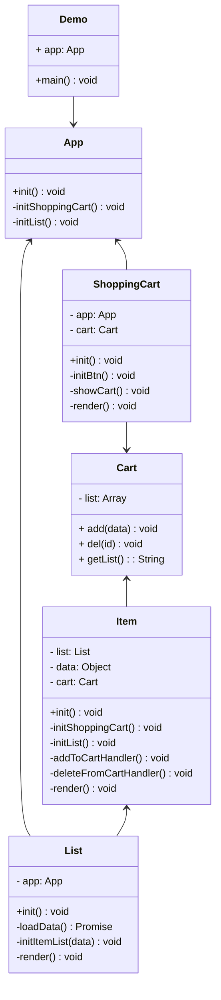

# 模拟购物车

## 功能点

- 显示购物列表
- 加入购物车
- 从购物车删除

## 设计模式

- 工厂模式
- 单例模式
- 装饰器模式
- 观察者模式
- 状态模式
- 模板方法模式
- 代理模式

## UML类图



## 实践

### 目录结构

- index.js
- index.html
  - Demo
    - List
      - CreateItem.js
      - Item.js
      - List.js
    - ShoppingCart
      - GetCart.js
      - ShoppingCart.js
    - util
      - log.js
    - App.js
    - data.json

### 代码

index.html 入口模板

```html
<!DOCTYPE html>
<html lang="en">
<head>
  <meta charset="UTF-8">
  <meta http-equiv="X-UA-Compatible" content="IE=edge">
  <meta name="viewport" content="width=device-width, initial-scale=1.0">
  <title>模拟购物车</title>
</head>
<body>
  <div id="app"></div>
</body>
<script src="./index.js"></script>
</html>
```

index.js 入口文件

```js
import App from './demo/App.js'

const app = new App('app')
app.init('app')
```

商品处理
demo/List/CreateItem.js

```js
import Item from './Item.js'

// 工厂函数 - 工厂模式
export default function (list, itemData) {
  if (itemData.discount) {
    itemData = createDiscount(itemData)
  }
  return new Item(list, itemData)
}

// 代理模式, 感觉这里用有些生硬
const createDiscount = itemData => {
  return new Proxy(itemData, {
    get: (target, key) => {
      if (key === 'name') {
        return `${target[key]}【折扣💰】`
      }
      if (key === 'price') {
        return target[key] * 0.8
      }
      return target[key]
    }
  })
}
```

商品列表项类
demo/List/Item.js

```js
import getCart from '../ShoppingCart/GetCart.js'
import StateMachine from 'javascript-state-machine'
import { log } from './../util/log.js'
export default class Item {
  constructor(list, data) {
    this.list = list
    this.data = data
    this.$el = document.createElement("DIV")
    this.cart = getCart && getCart()
  }

  initContent() {
    const $el = this.$el
    const data = this.data
    const nameDom = document.createElement("P")
    nameDom.innerHTML = `名称：${data.name}`
    const priceDom = document.createElement("P")
    priceDom.innerHTML = `价格：${data.price}`
    $el.append(nameDom)
    $el.append(priceDom)
  }

  initBtn() {
    const $el = this.$el
    const btn = document.createElement("BUTTON")
    
    // 状态模式
    const fsm = new StateMachine({
      init: '加入购物车',
      transitions: [
        {
          name: 'addToCart',
          from: '加入购物车',
          to: '从购物车删除'
        },
        { 
          name: 'deleteFromCart',
          from: '从购物车删除',
          to: '加入购物车'
        }
      ],
      methods: {
        // 加入购物车
        onAddToCart: () => {
          this.addToCartHandler()
          updateText()
        },
        // 从购物车删除
        onDeleteFromCart: () => {
          this.deleteFromCartHandler()
          updateText()
        }
      }
    })

    const updateText = () => {
      btn.innerHTML = fsm.state
    }
    btn.onclick = () => {
      // 添加到购物车
      if (fsm.is('加入购物车')) {
        fsm.addToCart()
      // 从购物车移除
      } else if (fsm.is('从购物车删除')) {
        fsm.deleteFromCart()
      }
    }
    updateText()
    $el.append(btn)
  }

  @log('add')
  addToCartHandler() {
    this.cart.add(this.data)
  }

  @log('del')
  deleteFromCartHandler() {
    this.cart.del(this.data.id)
  }

  render() {
    this.list.$el.append(this.$el)
  }

  init() {
    this.initContent()
    this.initBtn()
    this.render()
  }
}
```

商品列表类
demo/List/List.js

```js
import goodsData from './../data.json'
import createItem from './CreateItem.js'

export default class List {
  constructor(app) {
    this.app = app
    this.$el = document.createElement("DIV")
  }

  // 获取数据
  loadData() {
    return new Promise(resolve => {
      resolve(goodsData)
    })
  }

  // 生成列表
  initItemList(data) {
    data.forEach(itemData => {
      const item = createItem(this, itemData)
      item.init()
    })
  }

  // 渲染
  render() {
    this.app.$el.append(this.$el)
  }

  async init() {
    const data = await this.loadData()
    this.initItemList(data)
    this.render()
  }
}
```

购物车类（内存逻辑）
demo/ShoppingCart/GetCart.js

```js
// 购物车内存
class Cart {
  constructor() {
    this.list = [];
  }

  add(data) {
    this.list.push(data)
  }

  del(id) {
    const delIndex = this.list.findIndex(x => x.id === id)
    this.list.splice(delIndex, 1)
  }

  getList() {
    return this.list.map(x => x.name)
  }

  getCart() {
    return cartInstance
  }
}

let cartInstance = null

// 返回单例 - 单例模式
const getCart = (() => () => {
  if (!cartInstance) {
    cartInstance = new Cart()
  }
  return cartInstance
})()

export default getCart
```

购物车容器类
demo/ShoppingCart/shoppingCart.js

```js
import getCart from '../ShoppingCart/GetCart.js'

export default class ShoppingCart {
  constructor(app) {
    this.app = app
    this.$el = document.createElement('div')
    this.cart = getCart && getCart()
  }

  initBtn() {
    const btnDom = document.createElement('button')
    btnDom.innerHTML = '购物车'
    btnDom.onclick = () => {
      this.showCart()
    }
    this.$el.append(btnDom)
  }

  showCart() {
    console.log(this.cart.getList())
  }

  render() {
    this.app.$el.append(this.$el)
  }

  init() {
    this.initBtn()
    this.render()
  }
}
```

日志上报处理
demo/util/log.js

```js
// 装饰器模式
const log = type => (target, name, descriptor) => {
  const oldValue = descriptor.value
  descriptor.value = function() {
    console.log(`日志上报 ${type}`)
    return oldValue.apply(this, arguments)
  }
  return descriptor
}

export { log }
```

App 类
demo/App.js

```js
import ShoppingCart from './ShoppingCart/ShoppingCart'
import List from './List/List'

export default class App {
  constructor(id) {
    this.$el = document.getElementById(`${id}`);
  }

  // 初始化购物车
  initShoppingCart() {
    const shoppingCart = new ShoppingCart(this)
    shoppingCart.init()
  }

  // 初始化列表
  initList() {
    const list = new List(this)
    list.init()
  }

  init() {
    this.initShoppingCart()
    this.initList()
  }
}
```

mock 数据
demo/data.json

```json
[
  {
    "id": 1,
    "name": "aaa",
    "price": 111,
    "discount": 1
  },
  {
    "id": 2,
    "name": "bbb",
    "price": 222,
    "discount": 1
  },
  {
    "id": 3,
    "name": "ccc",
    "price": 333,
    "discount": 0
  },
  {
    "id": 4,
    "name": "ddd",
    "price": 444,
    "discount": 0
  }
]
```
