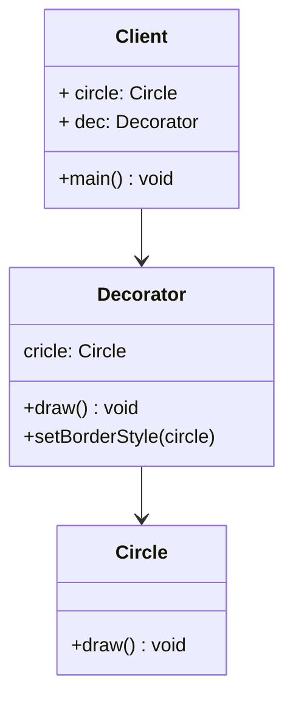

# 装饰器模式 Decorator Pattern

## 介绍

- 为对象添加新功能
- 不改变其原有的结构和功能

## 示例

类图：



```js
class Circle {
  draw(){
    console.log('draw circle')
  }
}

class Decorator{
  constructor(circle) {
    this.circle = new Circle()
  }

  draw() {
    this.circle.draw()
    this.setborderStyle()
  }

  setborderStyle() {
    console.log('set style..')
  }
}

const circle = new Circle()
circle.draw()
const dec = new Decorator(circle)
dec.draw()
```

## 应用场景

### ES7 装饰器

定义一个类 Demo，定义装饰器 testDec, `@testDec`写在`class Demo`前，testDec 可以获取到参数 target，即当前的 demo 类。然后就可以在 testDec 中对 demo 的属性做处理。

例子 1, 带参的装饰器

```js
// 需安装 @babel/plugin-proposal-decorators
@testDec(false)
class Demo{

}

function testDec(isDec) {
  return function (target){
    target.isDec = isDec
  }
}
console.log(Demo.isDec)
```

装饰器对类的行为的改变是在代码编译时发生的，不是在运行时

```js
@decorators
class A{}
// 相当于 👇🏻
class A{}
A = decorators(A) || A
```

例子 2

```js
function mixins(list) {
  return function (target) {
    Object.assign(target.prototype, ...list);
  }
}

const Foo1 = {
  foo1() {
    console.log('foo1')
  }
}

const Foo2 = {
  foo2() {
    console.log('foo2')
  }
}

@mixins([Foo1, Foo2])
class MyClass{}

const obj = new MyClass()
obj.foo1()
obj.foo2()
```

例子 3

```js
function readOnly(target, prop, description) {
  description.writable = false
  return description
}

class Person {
  constructor() {
    this.name = 'olu'
    this.age = 18
  }

  // 装饰方法
  @readOnly
  getInfo() {
    return `name: ${this.name}, age: ${this.age}`
  }
}

const p = new Person
p.getInfo = function() {
  console.log('olucool')
}
console.log(p.getInfo()) // 还是原先的，未被修改
```

例子 4

```js
function log (target, name, description) {
  const oldValue = description.value
  description.value = function () {
    console.log(`calling ${name} with ${arguments}`)
    return oldValue.apply(this, arguments)
  }
  return description
}

class Math{
  @log
  add(a, b) {
    return a + b
  }
}

const m = new Math();
const sum = m.add(1,4) // 5
```

### 三方库 core-decorators

## 设计原则验证

- 将现有对象和装饰器进行分离，两者独立存在
- 符合开放封闭原则
