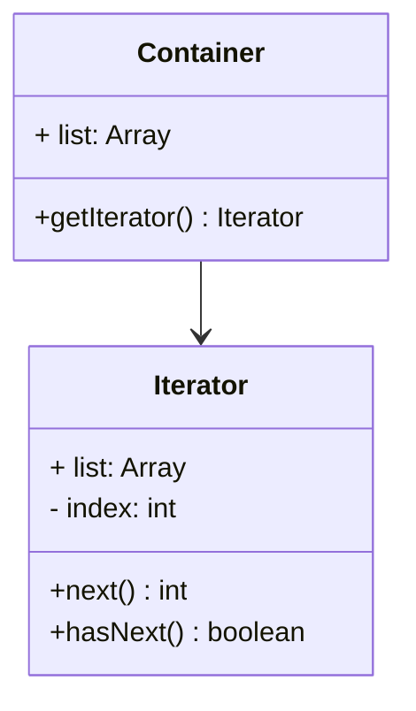

# 迭代器模式 Iterator Pattern

## 介绍

- 按顺序访问一个集合
- 使用者无需知道集合的内部结构（封装）

## 示例



```js
class Container {
  constructor(list) {
    this.list = list;
  }

  getIterator() {
    return new Iterator(this)
  }
}
class Iterator {
  constructor(container) {
    this.list = container.list
    this.index = 0
  }

  hasNext() {
    return this.list[this.index]
  }

  next() {
    if (!this.hasNext()) {
      return null
    }
    return this.list[this.index++]
  }
}

const arr = [1, 2, 3, 4, 5]
const container = new Container(arr)
const iterator = container.getIterator()
while(iterator.hasNext()) {
  console.log(iterator.next())
}
```

## 应用场景

### each 处理可迭代对象

```html
<div id="wrapper">
  <a href="#">a1</a>
  <a href="#">a2</a>
  <a href="#">a3</a>
  <a href="#">a4</a>
  <a href="#">a5</a>
</div>
<script>
  const arr = [1, 2, 3]
  // 类数组
  const nodeList = document.getElementsByTagName('a')

  arr.forEach(x => {
    console.log(x)
  })

  // 类数组遍历不能用 forEach
  for(let i = 0; i < nodeList.length; i += 1) {
    console.log(nodeList[i])
  }

  // 都转成数组
  function each(val) {
    Array.from(val).forEach((k, v) => {
      console.log(k, v)
    })
  }
</script>
```

### ES6 Iterator

#### 有序数据集合类型

- Array
- Map
- Set
- String
- TypedArray 类型化数组
- arguments 函数参数
- NodeList 类数组

#### 有序数据集合特点

- 都有 [Symbol.iterator] 属性
- 属性值是函数，执行函数返回一个迭代器
- 迭代器有 next 方法可顺序迭代子元素
- 可运行 Array.prototype[Symbol.iterator] 进行测试

#### 实践

```js
function each(data) {
  const iterator = data[Symbol.iterator]()

  let item = {done: false}
  while(!item.done) {
    item = iterator.next()
    if (!item.done) {
      console.log(item.value)
    }
  }
}
```

## 设计原则验证

- 迭代器对象和目标对象分离
- 迭代器将使用者和目标对象隔离开
- 符合开放封闭原则
