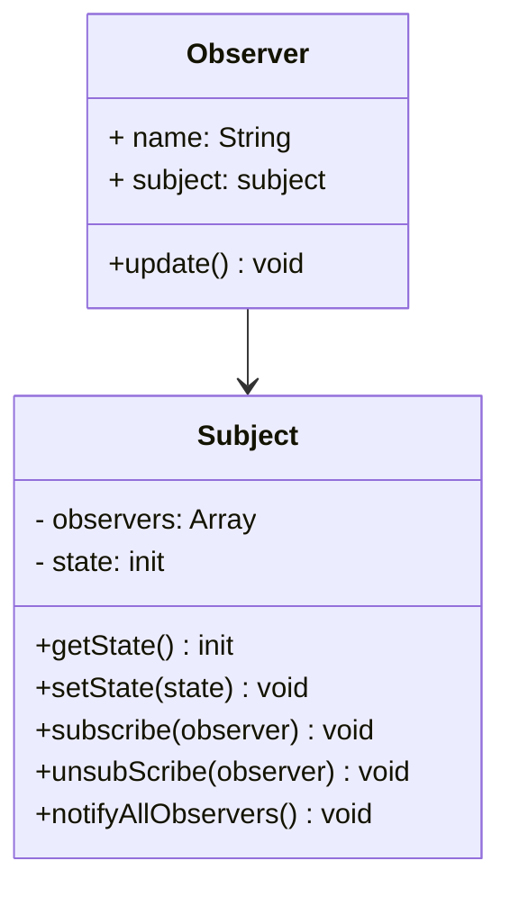

# 观察者模式 Observer Pattern

## 介绍

- 发布 & 订阅
- 一对多

## 示例

类图：



```js
class Subject {
  constructor() {
    this.state = 0
    this.observers = []
  }

  getState() {
    return this.state
  }

  setState(state) {
    this.state = state
    this.notifyAllObservers()
  }

  notifyAllObservers() {
    this.observers.forEach(observer => {
      observer.update()
    })
  }

  subscribe(observer) {
    this.observers.push(observer)
  }

  unsubScribe(observer) {
    this.observers = this.observers.filter(o => o !== observer)
  }
}

class Observer {
  constructor(name, subject) {
    this.name = name
    this.subject = subject
    this.subject.subscribe(this)
  }

  update() {
    console.log(`${this.name} update, state: ${this.subject.getState()}`)
  }
}

let s = new Subject()
let o = new Observer('olu', s)
s.setState(1)
s.unsubScribe(o)
```

## 应用场景

### 网页事件绑定

事件监听

```html
<button type="button" id="btn">olu cool</button>

<script>
  const btn = document.getElementById('btn');
  btn.addEventListener('click', () => {
    console.log(1)
  })
  btn.addEventListener('click', () => {
    console.log(2)
  })
  btn.addEventListener('click', () => {
    console.log(3)
  })
</script>
```

### jQuery callbacks

```js
const callbacks = $.Callbacks()
callbacks.add(info => {
  console.log(1, info)
})
callbacks.add(info => {
  console.log(2, info)
})
callbacks.add(info => {
  console.log(3, info)
})
callbacks.fire('olu')
// 1 olu
// 2 olu
// 3 olu
```

### nodejs 自定义事件

```js
const EventEmitter = require('events').EventEmitter

const emitter1 = new EventEmitter()

emitter1.on('some', () => {
  console.log(1)
})

emitter2.on('some', () => {
  console.log(2)
})

emitter1.emit('some')
```

```js
const EventEmitter = require('events').EventEmitter

class Dog extends EventEmitter {
  constructor(name) {
    super()
    this.name = name
  }
}

const corgi = new Dog('Tango')
corgi.on('call', () => {
  console.log(corgi.name, 'coming~')
})
setInterval(() => {
  corgi.emit('call')
}, 500)
```

```js
const fs = require('fs')
const readStream = fs.createReadStream('./data.txt')

let length = 0
readStream.on('data', chunk => {
  length += chunk.toString().length
})
readStream.on('end', () => {
  console.log(length)
})
```

```js
const readline = require('readline')
const fs = require('fs')

const rl = readline.createInterface({
  input: fs.createReadStream('./data.txt')
})

let lineNum = 0
rl.on('line', line => {
  lineNum += 1
})
rl.on('close', () => {
  console.log(lineNum)
})
```

### nodejs 处理 http 请求，多进程通讯

```js
function serverCallback(req, res) {
  // 获取请求
  const method = req.method.toLowerCase()
  if (method === 'get') {
    // ...
  }
  if (method === 'post') {
    // 接受请求内容
    let data = ''
    req.on('data', chunk => {
      data += chunk.toString()
    })
    req.on('end', () => {
      // 接收完毕，输出内容
      res.writeHead(200, {'Content-type': 'application/json'})
      res.write(data)
      res.end()
    })
  }
}
```

### Vue React 组件生命周期触发

### Vue watch

## 设计原则验证

- 主题和观察者分离，不是主动触发而是被动监听，两者解耦
- 符合开放封闭原则
