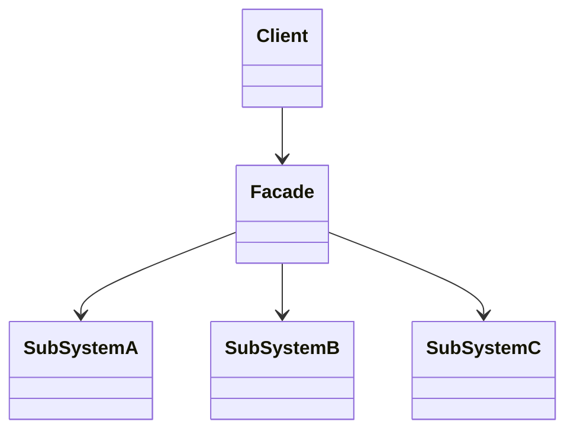

# 外观模式 Facade Pattern

## 介绍

- 为子系统中的一组接口提供了一个高层接口
- 使用者使用这个高层接口

## 示例

类图：



## 应用场景

### 生活场景 医院接待员

去医院看病，接待员代替我们去挂号、门诊、划价、取药

### 兼容参数

```js
function bindEvent(ele, type, seletor, fn) {
  if (fn === null) {
    fn = seletor
    seletor = null
  }
}

bindEvent(ele, 'click', fn)
```

## 设计原则验证

- 不符合单一职责原则和开放封闭原则
