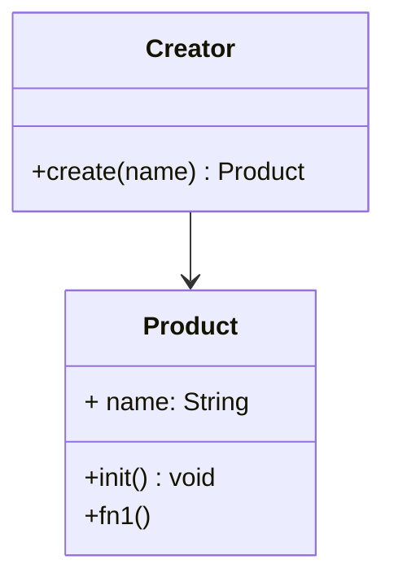

# 工厂模式

## 🎺介绍

- 将 `new` 操作单独封装
- 遇到 `new` 时要考虑工厂模式

## ⛹示例

类图：



```js
class Creator {
  create(name) {
    return new Product(name)
  }
}

class Product {
  constructor(name) {
    this.name = name;
  }
  init() {
    console.log('init')
  }

  fn1() {
    console.log('fn1')
  }
}

const creator = new Creator()
const c = creator.create('olu')
c.init()
c.fn1()
```

## ⛹️应用场景

### jQuery - $('div')

```js
class jQuery {
  constructor(seletor) {
    let slice = Array.prototype.slice
    let dom = slice.call(document.querySelectorAll(seletor))
    let len = dom ? dom.length : 0
    for (let i = 0; i < len; i += 1) {
      this[i] = dom[i]
    }
    this.length = len
    this.seletor = seletor || ''
  }
  append(node) {

  }
  addClass(name) {

  }
  html(data)
}

window.$ = function(seletor) {
  return new jQuery(seletor);
}
```

### React.createElement

```js
let profile = <div>
  
  <h1>{[user.name, user.age].join(' ')}</h1>
</div>
```

上面的代码编译完是下面的样子👇🏻

```js
let profile = React.createElement("div", null,
  React.createElement("img", { src: "olu-cool.png", className: "img" }),
  React.createElement("h1", null, [user.name, user.age].join(' '))
)
```

```js
class Vnode(tag, attrs, children) {
  // ...
}
React.createElement = function(tag, attrs, children) {
  return new Vnode(tag, attrs, children)
}
```

### Vue 异步组件

```js
Vue.component('async-example', (resolve, reject) => {
  setTimeout(() => {
    resolve({
      template: '<div>this is async</div>',
    })
  }, 500)
})
```

## 设计原则验证

- 构造函数和创建者分离
- 符合开放封闭原则
