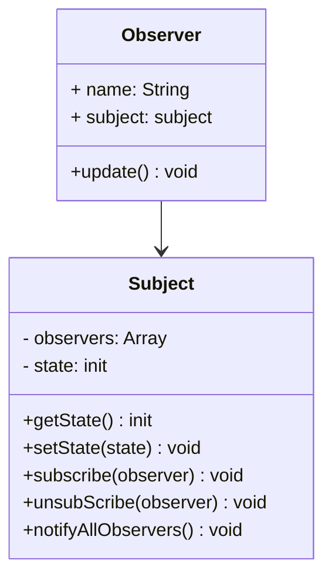

# 观察者模式 Observer Pattern

## 介绍

- 发布 & 订阅
- 一对多

## 示例

类图：



```js
class Subject {
  constructor() {
    this.state = 0
    this.observers = []
  }

  getState() {
    return this.state
  }

  setState(state) {
    this.state = state
    this.notifyAllObservers()
  }

  notifyAllObservers() {
    this.observers.forEach(observer => {
      observer.update()
    })
  }

  subscribe(observer) {
    this.observers.push(observer)
  }

  unsubScribe(observer) {
    this.observers = this.observers.filter(o => o !== observer)
  }
}

class Observer {
  constructor(name, subject) {
    this.name = name
    this.subject = subject
    this.subject.subscribe(this)
  }

  update() {
    console.log(`${this.name} update, state: ${this.subject.getState()}`)
  }
}

let s = new Subject()
let o = new Observer('olu', s)
s.setState(1)
s.unsubScribe(o)
```

## 应用场景

### 网页事件绑定

事件监听

```html
<button type="button" id="btn">olu cool</button>

<script>
  const btn = document.getElementById('btn');
  btn.addEventListener('click', () => {
    console.log(1)
  })
  btn.addEventListener('click', () => {
    console.log(2)
  })
  btn.addEventListener('click', () => {
    console.log(3)
  })
</script>
```

### jQuery callbacks

```js
const callbacks = $.Callbacks()
callbacks.add(info => {
  console.log(1, info)
})
callbacks.add(info => {
  console.log(2, info)
})
callbacks.add(info => {
  console.log(3, info)
})
callbacks.fire('olu')
// 1 olu
// 2 olu
// 3 olu
```

### nodejs 自定义事件
