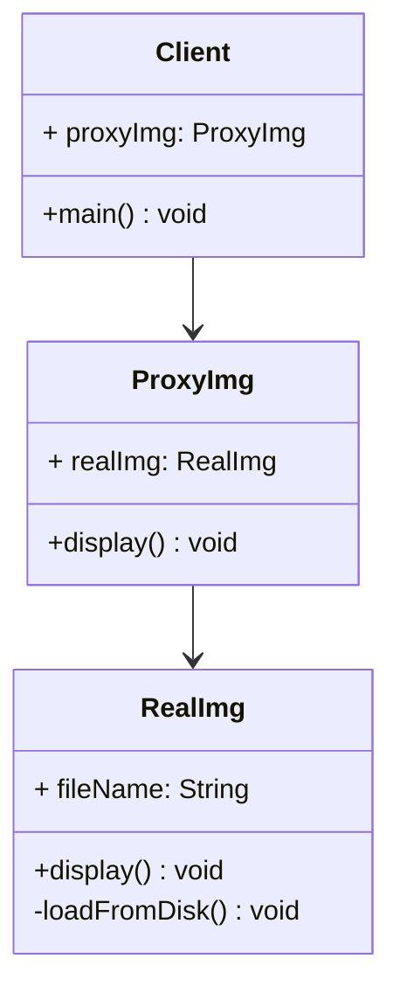

# 代理模式 Proxy Pattern

## 介绍

- 使用者无权访问目标对象
- 中间加代理，通过代理做授权和控制

## 示例

类图：



```js
class RealImg {
  constructor(fileName) {
    this.fileName = fileName
    this.loadFromDisk()
  }

  loadFromDisk() {
    console.log(`loading...${this.fileName}`)
  }

  display() {
    console.log(`display...${this.fileName}`)
  }
}

class ProxyImg {
  constructor(fileName) {
    this.realImg = new RealImg(fileName)
  }

  display() {
    this.realImg.display()
  }
}

const proxyImg = new ProxyImg('hello')
proxyImg.display()
```

## 应用场景

### 网页事件代理

```html
<div id="wrapper">
  <a href="#">a1</a>
  <a href="#">a2</a>
  <a href="#">a3</a>
  <a href="#">a4</a>
  <a href="#">a5</a>
  <a href="#">a6</a>
</div>
```

```js
const wrapper = document.getElementById('wrapper)
// 监听所有 a 标签的点击事件
wrapper.addEventListener('click', e => {
  const target = e.target
  if (target.nodeName === 'A') {
    console.log(target.innerHTML)
  }
})
```

### jQuery $.proxy

```js
$('#wrapper').click(function () {
  setTimeout($.proxy(function() {
    $(this).addClass('hello')
  }, this), 500)
})
```

### ES6 Proxy

```js
// 明星
const star = {
  name: 'olu', 
  age: 18,
  phone: 120110109,
}

// 经纪人
const agent = new Proxy(star, {
  get: function(target, key) {
    if (key === 'phone') {
      // 返回经纪人的手机号
      return 12315
    }
    if (key === 'price') {
      // 经纪人代替明星报价
      return 521
    }
    return target[key]
  }, 
  set: function(target, key, val) {
    if (key === 'customPrice') {
      if (val < 520) {
        // 报价最低 520
        throw new Error('olu 没有这么便宜！')
      } else {
        target[key] = val
        return true
      }
    }
  }
})

console.log(agent.name) // 明星的
console.log(agent.age) // 明星的
console.log(agent.phone) // 经纪人的
console.log(agent.price) // 经纪人提供
agent.customPrice = 11 // error
```

## 设计原则验证

- 代理类和目标类分离，隔离开目标类和使用者
- 符合开放封闭原则
