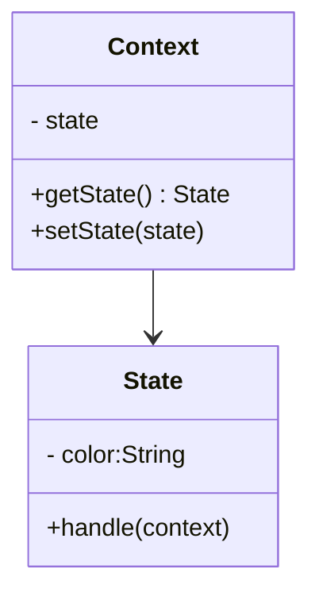

# 状态模式 State Pattern

## 介绍

- 一个对象有状态变化
- 每次状态变化都会触发一个逻辑
- 不能总是用 if...else 来控制

## 示例

交通信号灯不同颜色的变化

类图：



```js
// 状态（红黄绿）
class State {
  constructor(color) {
    this.color = color
  }
  handle(context) {
    console.log(`turn to ${this.color} light`)
    context.setState(this)
  }
}

class Context {
  constructor() {
    this.state = null
  }
  getState() {
    return this.state
  }
  setState(state) {
    this.state = state 
  }
}

const context = new Context()
const red = new State('red')
const green = new State('green')
const yellow = new State('yellow')
// 绿灯亮
green.handle(context)
console.log(context.getState())
```

## 应用场景

### 有限状态机

### javascript-state-machine

收藏 - 取消收藏

```html
<button id="btn"> ❤ </button>
<script>
import StateMachine from 'javascript-state-machine'

const btn = document.getElementById('btn');

const fsm = StateMachine({
  init: '未收藏',
  transitions: [
    {
      name: 'doStore',
      from: '未收藏',
      to: '已收藏'
    },
    {
      name: 'deleteStore',
      from: '已收藏'，
      to: '未收藏'
    }
  ],
  methods: {
    // 收藏
    onDoStore: function(){
      console.log('收藏成功')
      updateText()
    },
    // 取消收藏
    onDeleteStore: function() {
      console.log('取消收藏')
      updateText()
    }
  }
})

btn.addEventListener('click', () => {
  if (fsm.is('未收藏')) {
     fsm.doStore()
  } else {
    fsm.deleteStore()
  }
})

function updateText() {
  btn.innerText = fsm.state
}

updateText()
</script>
```

### 手写简陋 Promise

```js
import StateMachine from 'javascript-state-machine'

class MyPromise {
  constructor(fn) {
    this.fsm = new StateMachine({
      init: 'pending',
      transitions: [
        {
          name: 'resolve',
          from: 'pending',
          to: 'fullfilled'
        },
        {
          name: 'reject',
          from: 'pending',
          to: 'rejected'
        }
      ],
      methods: {
        onResolve: function(state, data) {
          data.successList.forEach(fn => fn())
        }, 
        onReject: function(state, data) {
          data.failList.forEach(fn => fn())
        }
      }
    })
    this.successList = [];
    this.failList = []

    fn(() => {
      fsm.resolve(this)
    }, () => {
      fsm.reject(this)
    })
  }

  then(successFn, failFn) {
    this.successList.push(successFn)
    this.failList.push(failFn)
  }
}

export default MyPromise
```

## 设计原则验证

- 将状态对象和主题对象分离，状态的变化逻辑单独处理
- 符合开放封闭原则
