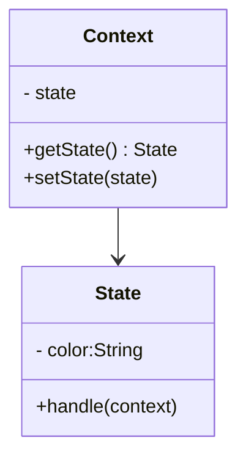

# 状态模式 State Pattern

## 介绍

- 一个对象有状态变化
- 每次状态变化都会触发一个逻辑
- 不能总是用 if...else 来控制

## 示例

### 电灯程序

有一个电灯，电灯上面只有一个开关。电灯开着的时候，按下开关，电灯会切换到关闭状态；再按一次开关，电灯又被打开。同一个开关按钮，在不同的状态下，表现出来的行为是不一样的。

先定义一个 `Light` 类，电灯对象 `light` 将从 `Light`类中创建。`light`对象有两个属性，用`state`来记录电灯当前的状态，`button`表示具体的开关按钮。

```js
class Light {
  constructor() {
    this.state = 'off'
    this.button = null
  }

  init() {
    const btnDom = document.createElement('button')
    btnDom.innerHTML = '开关'
    this.button = document.body.appendChild(btnDom)
    this.button.onclick = () => {
      this.buttonPressHandler()
    }
  }

  buttonPressHandler() {
    if (this.state === 'off') {
      console.log('开灯')
      this.state = 'on'
    } else if (this.state === 'on') {
      console.log('关灯')
      this.state = 'off'
    }
  }
}

const light = new Light()
light.init()
```

我们知道电灯有很多种，比如护眼灯可以切弱光灯和强光灯，开关按一下是弱光，按两下是强光，第三下才是关灯

```js
buttonPressHandler() {
  if (this.state === 'off') {
    console.log('开弱光')
    this.state = 'weakLight'
  } else if (this.state === 'weakLight') {
    console.log('开强光')
    this.state = 'strongLight'
  } else if (this.state === 'strongLight') {
    console.log('关灯')
    this.state = 'off'
  }
}
```

如果像上面这样搞，每次新增或者修改 `light` 的状态都需要改动 `buttonPressHandler` 里面的内容，这是违反开放封闭原则的。

通常情况我们说封装，一般都会优先封装对象的行为而不是对象的状态。状态模式却不是如此，状态模式的关键点是**把事物的每种状态都封装成单独的类**，跟状态有关的行为都被封装在这个类的内部。

改用状态模式的话，针对上面的例子需要定义 3 个状态类，分别是`OffLightState`、`WeakLightState`和`StrongLightState`, 这 3 个类都有一个原型方法 `buttonPressHandler`，代表在各自状态下，按钮被按下时将发生的行为。

```js
class OffLightState {
  constructor(light) {
    this.light = light
  }

  buttonPressHandler() {
    console.log('弱光')
    this.light.setState(this.light.weakLightState)
  }
}

class WeakLightState {
  constructor(light) {
    this.light = light
  }

  buttonPressHandler() {
    console.log('强光')
    this.light.setState(this.light.strongLightState)
  }
}

class OffLightState {
  constructor(light) {
    this.light = light
  }

  buttonPressHandler() {
    console.log('关灯')
    this.light.setState(this.light.offLightState)
  }
}
```

下面改写 `Light` 类，对每一个状态类都创建一个状态对象

```js
class Light {
  constructor() {
    this.offLightState = new OffLightState(this)
    this.weakLightState = new WeakLightState(this)
    this.strongLightState = new StrongLightState(this)
    this.button = null
  }
}
```

通过 `currentState.buttonPressHandler()`将请求委托给当前持有的状态对象去执行

```js
class Light {
  constructor() {
    this.offLightState = new OffLightState(this)
    this.weakLightState = new WeakLightState(this)
    this.strongLightState = new StrongLightState(this)
    this.button = null
  }

  setState(newState) {
    this.currentState = newState
  }

  init() {
    const btnDom = document.createElement("button")
    this.button = document.body.appendChild(btnDom)
    this.botton.innerHTML = '开关'
    this.currentState = this.offLightState
    this.button.onclick = () => {
      this.currentState.buttonPressHandler()
    }
  }
}
```

最终代码如下👇🏻

```js
class OffLightState {
  constructor(light) {
    this.light = light
  }

  buttonPressHandler() {
    console.log('弱光')
    this.light.setState(this.light.weakLightState)
  }
}

class WeakLightState {
  constructor(light) {
    this.light = light
  }

  buttonPressHandler() {
    console.log('强光')
    this.light.setState(this.light.strongLightState)
  }
}

class StrongLightState {
  constructor(light) {
    this.light = light
  }

  buttonPressHandler() {
    console.log('关灯')
    this.light.setState(this.light.offLightState)
  }
} 

class Light {
  constructor() {
    this.offLightState = new OffLightState(this)
    this.weakLightState = new WeakLightState(this)
    this.strongLightState = new StrongLightState(this)
    this.button = null
  }

  setState(newState) {
    this.currentState = newState
  }

  init() {
    const btnDom = document.createElement("button")
    btnDom.innerHTML = '开关'
    this.button = document.body.appendChild(btnDom)
    this.currentState = this.offLightState
    this.button.onclick = () => {
      this.currentState.buttonPressHandler()
    }
  }
}

const light = new Light()
light.init()
```

这样的话，如果哪天新增加了一种新的状态，比如超强光，那么就只需要增加一个新的状态类，再在 Light 类中新增一个对象。
观察发现状态类中有一些共同的行为方法，Context(及类也称作上下文) 最终会将请求委托给状态对象的这些方法。即上面例子中的 buttonPressHandler。
如果某次忘记给状态子类实现 buttonPressHandler 方法，就很糟糕了。所以这里我们可以搞一个抽象父类，让状态子类去继承，并在抽象父类中留下抛异常的行为。

```js
class State {
  buttonPressHandler() {
    throw new Error("父类的 buttonPressHandler 方法必须被重写")
  }
}

class OffLightState extends State {
  constructor(light) {
    super()
    this.light = light
  }

  buttonPressHandler() {
    console.log('弱光')
    this.light.setState(this.light.weakLightState)
  }
}


class WeakLightState extends State {
  constructor(light) {
    super()
    this.light = light
  }

  buttonPressHandler() {
    console.log('强光')
    this.light.setState(this.light.strongLightState)
  }
}

class StrongLightState extends State {
  constructor(light) {
    super()
    this.light = light
  }

  buttonPressHandler() {
    console.log('关灯')
    this.light.setState(this.light.offLightState)
  }
} 

class Light {
  constructor() {
    this.offLightState = new OffLightState(this)
    this.weakLightState = new WeakLightState(this)
    this.strongLightState = new StrongLightState(this)
    this.button = null
  }

  setState(newState) {
    this.currentState = newState
  }

  init() {
    const btnDom = document.createElement("button")
    btnDom.innerHTML = '开关'
    this.button = document.body.appendChild(btnDom)
    this.currentState = this.offLightState
    this.button.onclick = () => {
      this.currentState.buttonPressHandler()
    }
  }
}

const light = new Light()
light.init()
```
 
### 交通信号灯不同颜色的变化

类图：



```js
// 状态（红黄绿）
class State {
  constructor(color) {
    this.color = color
  }
  handle(context) {
    console.log(`turn to ${this.color} light`)
    context.setState(this)
  }
}

class Context {
  constructor() {
    this.state = null
  }
  getState() {
    return this.state
  }
  setState(state) {
    this.state = state 
  }
}

const context = new Context()
const red = new State('red')
const green = new State('green')
const yellow = new State('yellow')
// 绿灯亮
green.handle(context)
console.log(context.getState())
```

## 应用场景

### 有限状态机

### javascript-state-machine

收藏 - 取消收藏

```html
<button id="btn"> ❤ </button>
<script>
import StateMachine from 'javascript-state-machine'

const btn = document.getElementById('btn');

const fsm = StateMachine({
  init: '未收藏',
  transitions: [
    {
      name: 'doStore',
      from: '未收藏',
      to: '已收藏'
    },
    {
      name: 'deleteStore',
      from: '已收藏'，
      to: '未收藏'
    }
  ],
  methods: {
    // 收藏
    onDoStore: function(){
      console.log('收藏成功')
      updateText()
    },
    // 取消收藏
    onDeleteStore: function() {
      console.log('取消收藏')
      updateText()
    }
  }
})

btn.addEventListener('click', () => {
  if (fsm.is('未收藏')) {
     fsm.doStore()
  } else {
    fsm.deleteStore()
  }
})

function updateText() {
  btn.innerText = fsm.state
}

updateText()
</script>
```

### 手写简陋 Promise

```js
import StateMachine from 'javascript-state-machine'

class MyPromise {
  constructor(fn) {
    this.fsm = new StateMachine({
      init: 'pending',
      transitions: [
        {
          name: 'resolve',
          from: 'pending',
          to: 'fullfilled'
        },
        {
          name: 'reject',
          from: 'pending',
          to: 'rejected'
        }
      ],
      methods: {
        onResolve: function(state, data) {
          data.successList.forEach(fn => fn())
        }, 
        onReject: function(state, data) {
          data.failList.forEach(fn => fn())
        }
      }
    })
    this.successList = [];
    this.failList = []

    fn(() => {
      fsm.resolve(this)
    }, () => {
      fsm.reject(this)
    })
  }

  then(successFn, failFn) {
    this.successList.push(successFn)
    this.failList.push(failFn)
  }
}

export default MyPromise
```

## 设计原则验证

- 将状态对象和主题对象分离，状态的变化逻辑单独处理
- 符合开放封闭原则
