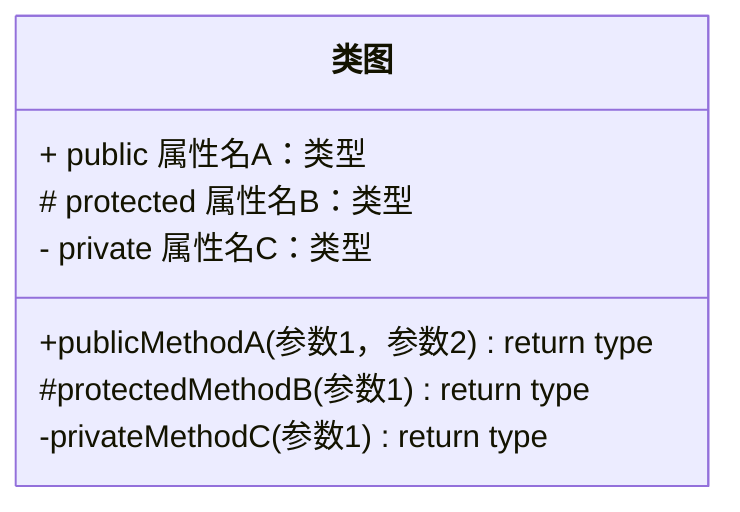
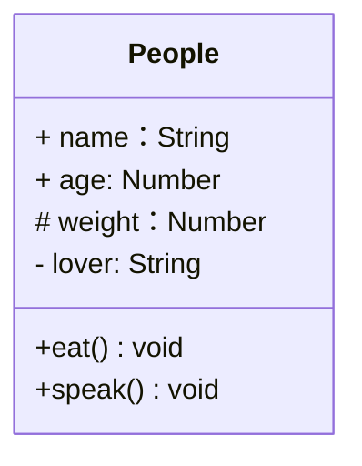
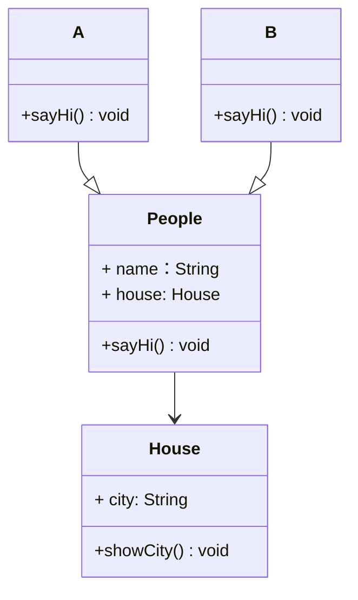
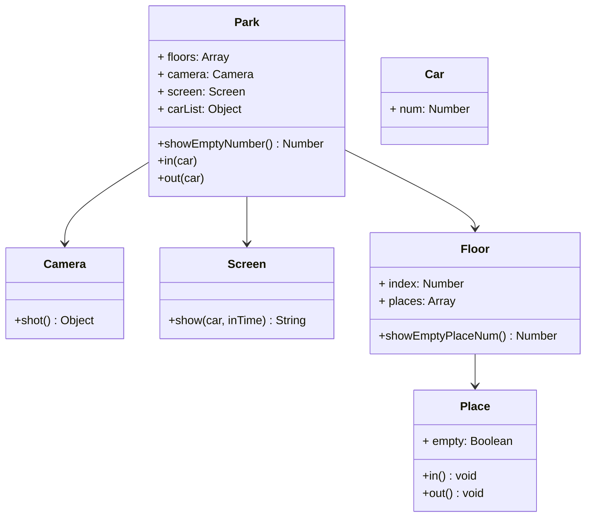

# UML类图

## ✏️概述

To specify the visibility of a class member (i.e. any attribute or method), these notations may be placed before the member's name, but it is optional:

- `+` Public
- `-` Private
- `#` Protected
- `~` Package/Internal



### 🌰举例

```js
class People {
  name
  age
  protected weight
  private lover
  constructor(name, age) {
    this.name = name;
    this.age = age
    this.weight = 250
    this.lover = 'olu'
  }
  eat() {
    console.log(`${this.name} eat something`)
  }
  speak() {
    console.log(`my name is ${this.name}, age ${this.age}`)
  }
}
```



## 关系

- 泛化（继承）
- 关联（引用）

### 🌰举例

```js
class People {
  constructor(name, house) {
    this.name = name;
    this.house = house
  }

  sayHi() {

  }
}

class A extends People {
  constructor(name, house) {
    super(name, house)
  }
  sayHi() {
    console.log('hello, I am A')
  }
}

class B extends People {
  constructor(name, house) {
    super(name, house)
  }
  sayHi() {
    console.log('hello, I am B')
  }
}

class House {
  constructor(city) {
    this.city = city
  }
  showCity() {
    console.log(`house is in ${city}`)
  }
}

const houseA = new House('China')
const olu = new A('olu', houseA)
```



### 实例分析

- 某停车场，分三层，每层 100 车位
- 每个车位都能监控到车辆的驶入和离开
- 车辆进入前，显示每层的空余车位数量
- 车辆进入时，摄像头可以识别车牌号和时间
- 车辆出来时，出口显示器显示车牌号和停车时长



```js
class Park {
  constructor() {
    this.floors = [];
    this.screen = new Screen();
    this.camera = new Camera();
    // 存储摄像头拍摄返回的车辆信息
    this.carList = {};
  }

  init() {
    for (let i = 0; i < 3; i += 1) {
      const places = [];
      for (let j = 0; j < 100; j += 1) {
        places[j] = new Place()
      }
      this.floors[i] = new Floor(i, places)
    }
  }

  showEmptyNumber() {
    return this.floors.map(floor => {
      return `第 ${floor.index + 1} 层有 ${floor.showEmptyNumber()} 个空位`
    }).join(', ')
  }

  // 通过摄像头获取信息
  in(car) {
    const shotInfo = this.camera.shot(car)
    const placeIdx = parseInt(Math.random() * 100, 10)
    const floorIdx = parseInt(Math.random() * 3, 10)
    const place = this.floors[floorIdx].places[placeIdx]
    if (place.isEmpty) {
      place.in()
      shotInfo.place = place
      this.carList[car.num] = shotInfo
    } else {
      this.in(car)
    }
    
  }

  // 通过显示器展示信息
  out(car) {
    const showInfo = this.carList[car.num]
    console.log(showInfo, car, this.carList)

    const place = showInfo.place
    this.screen.show(car, showInfo.inTime)
    place.out()
    delete this.carList[car.num]
  }
}

class Car {
  constructor(num) {
    this.num = num;
  }
}

class Floor {
  constructor(index, places) {
    this.index = index;
    this.places = places || [];
  }

  showEmptyNumber() {
    return this.places.filter(x => x.isEmpty === true).length
  }
}

class Place {
  constructor() {
    this.isEmpty = true;
  }

  in () {
    this.isEmpty = false;
  }

  out () {
    this.isEmpty = true;
  }
}

class Camera {
  shot(car) {
    return {
      num: car.num,
      inTime: Date.now()
    }
  }
}

class Screen {
  show(car, inTime) {
    console.log(`车牌号：${car.num}, 停车时长：${Date.now() - inTime}`)
  }
}

const p = new Park()
p.init()
const car1 = new Car('A11111')
const car2 = new Car('B66666')
const car3 = new Car('C99999')
const car4 = new Car('olu0000')

p.in(car1)
p.in(car2)
p.in(car3)
p.in(car4)
p.out(car1)
p.showEmptyNumber()
```