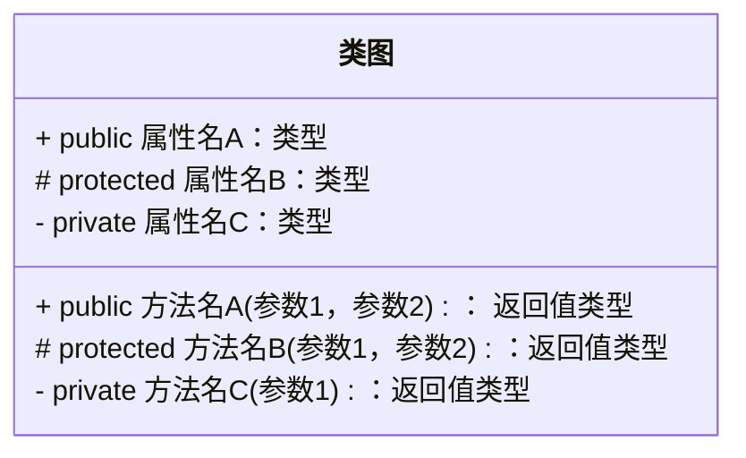

# UML类图

## 类图

```mermaid
classDiagram
class 类图
类图 : + public 属性名A：类型
类图 : # protected 属性名B：类型
类图 : - private 属性名C：类型
类图 : + public 方法名A(参数1，参数2)： 返回值类型
类图 : # protected 方法名B(参数1，参数2)：返回值类型
类图 : - private 方法名C(参数1)：返回值类型
```