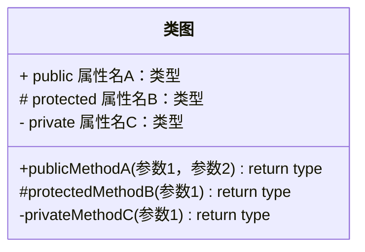
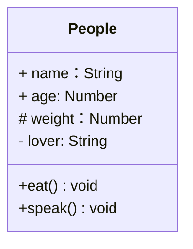

# UML类图

## ✏️类图

To specify the visibility of a class member (i.e. any attribute or method), these notations may be placed before the member's name, but it is optional:

- `+` Public
- `-` Private
- `#` Protected
- `~` Package/Internal



## 🌰举例

```js
class People {
  name
  age
  protected weight
  private lover
  constructor(name, age) {
    this.name = name;
    this.age = age
    this.weight = 250
    this.lover = 'olu'
  }
  eat() {
    console.log(`${this.name} eat something`)
  }
  speak() {
    console.log(`my name is ${this.name}, age ${this.age}`)
  }
}
```


