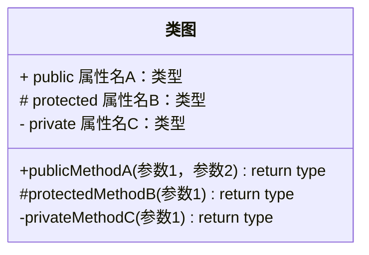
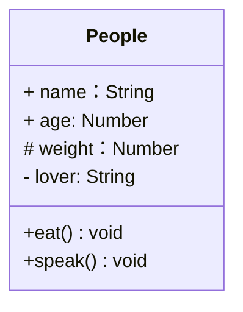
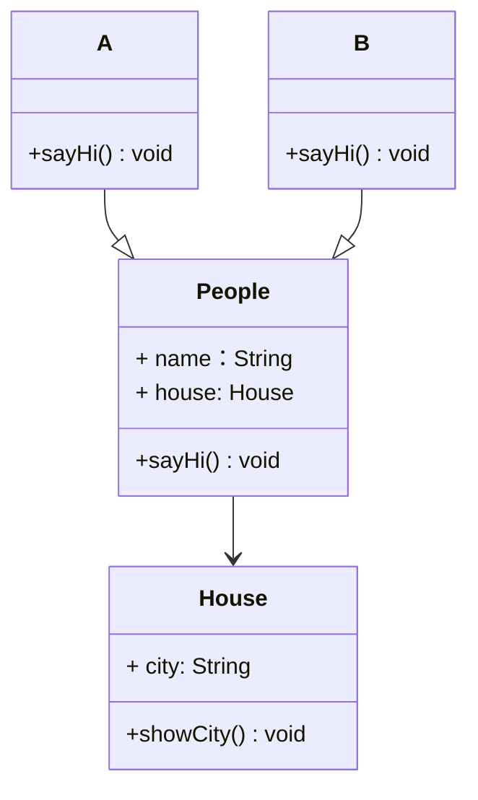

# UML类图

## ✏️概述

To specify the visibility of a class member (i.e. any attribute or method), these notations may be placed before the member's name, but it is optional:

- `+` Public
- `-` Private
- `#` Protected
- `~` Package/Internal



### 🌰举例

```js
class People {
  name
  age
  protected weight
  private lover
  constructor(name, age) {
    this.name = name;
    this.age = age
    this.weight = 250
    this.lover = 'olu'
  }
  eat() {
    console.log(`${this.name} eat something`)
  }
  speak() {
    console.log(`my name is ${this.name}, age ${this.age}`)
  }
}
```



## 关系

- 泛化（继承）
- 关联（引用）

### 🌰举例

```js
class People {
  constructor(name, house) {
    this.name = name;
    this.house = house
  }

  sayHi() {

  }
}

class A extends People {
  constructor(name, house) {
    super(name, house)
  }
  sayHi() {
    console.log('hello, I am A')
  }
}

class B extends People {
  constructor(name, house) {
    super(name, house)
  }
  sayHi() {
    console.log('hello, I am B')
  }
}

class House {
  constructor(city) {
    this.city = city
  }
  showCity() {
    console.log(`house is in ${city}`)
  }
}

const houseA = new House('China')
const olu = new A('olu', houseA)
```



### 实例分析

- 某停车场，分三层，每层 100 车位
- 每个车位都能监控到车辆的驶入和离开
- 车辆进入前，显示每层的空余车位数量
- 车辆进入时，摄像头可以识别车牌号和时间
- 车辆出来时，出口显示器显示车牌号和停车时长