```mermaid
classDiagram
class People
class People{
    + name：String
    + age: Number
    # weight：Number
    - lover: String
    +eat () void
    +speak () void
}
```

# UML类图

## ✏️概述

To specify the visibility of a class member (i.e. any attribute or method), these notations may be placed before the member's name, but it is optional:

- `+` Public
- `-` Private
- `#` Protected
- `~` Package/Internal

```mermaid
classDiagram
class 类图
class 类图{
    + public 属性名A：类型
    # protected 属性名B：类型
    - private 属性名C：类型
    +publicMethodA (参数1，参数2) return type
    #protectedMethodB (参数1) return type
    -privateMethodC(参数1) return type
}
```

### 🌰举例

```js
class People {
  name
  age
  protected weight
  private lover
  constructor(name, age) {
    this.name = name;
    this.age = age
    this.weight = 250
    this.lover = 'olu'
  }
  eat() {
    console.log(`${this.name} eat something`)
  }
  speak() {
    console.log(`my name is ${this.name}, age ${this.age}`)
  }
}
```



## 关系

- 泛化（继承）
- 关联（引用）

### 🌰举例

```js
class People {
  constructor(name, house) {
    this.name = name;
    this.house = house
  }

  sayHi() {

  }
}

class A extends People {
  constructor(name, house) {
    super(name, house)
  }
  sayHi() {
    console.log('hello, I am A')
  }
}

class B extends People {
  constructor(name, house) {
    super(name, house)
  }
  sayHi() {
    console.log('hello, I am B')
  }
}

class House {
  constructor(city) {
    this.city = city
  }
  showCity() {
    console.log(`house is in ${city}`)
  }
}

const houseA = new House('China')
const olu = new A('olu', houseA)
```

